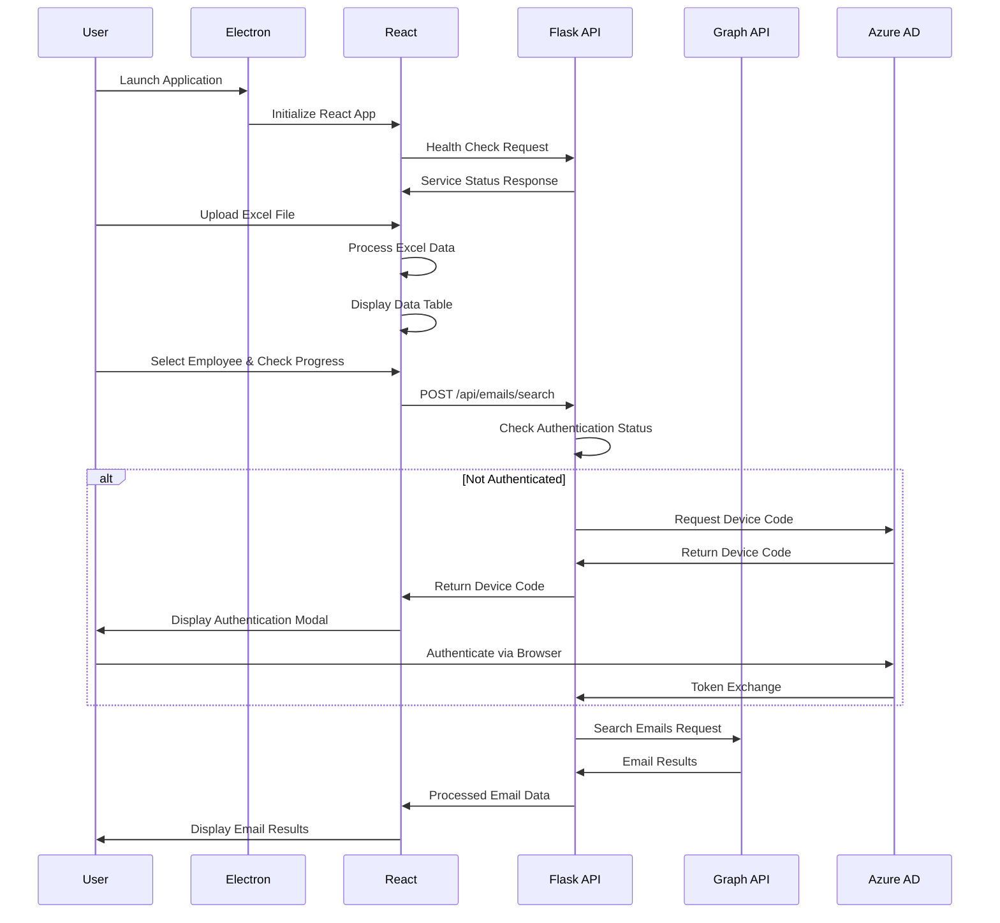

# KNGS Email Progress Checker - Technical Architecture Documentation

## Overview

This document provides an in-depth technical analysis of the KNGS Email Progress Checker architecture, implementation patterns, and internal mechanisms. It serves as a comprehensive reference for developers, system architects, and technical stakeholders.

## System Architecture

### High-Level Architecture

```
┌─────────────────────────────────────────────────────────────────┐
│                    KNGS Email Progress Checker                  │
├─────────────────────────────────────────────────────────────────┤
│  Presentation Layer (Electron + React)                         │
│  ├─ Main Process (Electron)      ├─ Renderer Process (React)   │
│  │  ├─ Window Management         │  ├─ UI Components           │
│  │  ├─ Menu System               │  ├─ State Management        │
│  │  └─ Inter-Process Comm.       │  └─ API Communication       │
├─────────────────────────────────────────────────────────────────┤
│  Application Layer (Python Flask)                              │
│  ├─ REST API Controllers         ├─ Business Logic             │
│  │  ├─ Authentication Endpoints  │  ├─ Excel Processing        │
│  │  ├─ Email Search Endpoints    │  ├─ Email Analysis          │
│  │  └─ Health Check Endpoints    │  └─ Data Correlation        │
├─────────────────────────────────────────────────────────────────┤
│  Integration Layer                                              │
│  ├─ Microsoft Graph SDK          ├─ Authentication Manager     │
│  │  ├─ Mail API Client           │  ├─ Device Code Flow        │
│  │  ├─ User API Client           │  ├─ Token Management        │
│  │  └─ Request/Response Handler  │  └─ Session Management      │
├─────────────────────────────────────────────────────────────────┤
│  External Services                                              │
│  ├─ Microsoft Graph API          ├─ Azure Active Directory     │
│  │  ├─ /me/messages endpoints    │  ├─ OAuth 2.0 endpoints     │
│  │  ├─ /me/mailFolders endpoints │  ├─ Device code endpoints   │
│  │  └─ /users endpoints          │  └─ Token endpoints         │
└─────────────────────────────────────────────────────────────────┘
```

### Component Interaction Flow



## Frontend Architecture (Electron + React)

### Electron Main Process

#### File Structure
```
main.js                 # Main process entry point
├─ Window Management    # BrowserWindow configuration
├─ Menu System         # Application menu setup
├─ IPC Handlers        # Inter-process communication
└─ Lifecycle Events    # App lifecycle management
```

#### Key Components

**main.js** - Core Electron application:
```javascript
const { app, BrowserWindow, Menu } = require('electron');
const path = require('path');
const isDev = require('electron-is-dev');

class ElectronApp {
  constructor() {
    this.mainWindow = null;
    this.initialize();
  }

  initialize() {
    app.whenReady().then(() => this.createWindow());
    app.on('window-all-closed', () => this.handleWindowsClosed());
    app.on('activate', () => this.handleActivate());
  }

  createWindow() {
    this.mainWindow = new BrowserWindow({
      width: 1200,
      height: 800,
      webPreferences: {
        nodeIntegration: false,
        contextIsolation: true,
        enableRemoteModule: false
      }
    });
    
    const startUrl = isDev 
      ? 'http://localhost:3000' 
      : `file://${path.join(__dirname, '../build/index.html')}`;
    
    this.mainWindow.loadURL(startUrl);
  }
}
```

### React Application Architecture

#### Component Hierarchy
```
App.js (Root Component)
├─ Router (React Router)
│  ├─ Main Route
│  │  ├─ FileUpload Component
│  │  └─ DataView Component
│  └─ Progress Route
│     └─ EmployeeSelector Component
├─ Global State Context
├─ API Service Layer
└─ Utility Functions
```

#### State Management Pattern

**App.js** - Main application state:
```javascript
function App() {
  const [excelData, setExcelData] = useState([]);
  const [employees, setEmployees] = useState([]);
  const [authStatus, setAuthStatus] = useState({
    authenticated: false,
    user: null
  });
  const [emailResults, setEmailResults] = useState([]);

  // Context provider for global state
  return (
    <AppContext.Provider value={{
      excelData, setExcelData,
      employees, setEmployees,
      authStatus, setAuthStatus,
      emailResults, setEmailResults
    }}>
      <Router>
        <Routes>
          <Route path="/" element={<MainPage />} />
          <Route path="/progress" element={<ProgressPage />} />
        </Routes>
      </Router>
    </AppContext.Provider>
  );
}
```

#### Component Design Patterns

**FileUpload.js** - File processing component:
```javascript
const FileUpload = () => {
  const [uploading, setUploading] = useState(false);
  const [error, setError] = useState(null);
  const { setExcelData, setEmployees } = useAppContext();

  const processExcelFile = useCallback(async (file) => {
    setUploading(true);
    try {
      const workbook = XLSX.read(await file.arrayBuffer());
      const worksheet = findProgressSheet(workbook);
      const data = XLSX.utils.sheet_to_json(worksheet);
      
      const processedData = validateAndProcessData(data);
      setExcelData(processedData);
      setEmployees(extractUniqueEmployees(processedData));
    } catch (err) {
      setError(err.message);
    } finally {
      setUploading(false);
    }
  }, [setExcelData, setEmployees]);

  return (
    <div className="file-upload-container">
      <DropZone onFileUpload={processExcelFile} />
      {uploading && <LoadingSpinner />}
      {error && <ErrorMessage message={error} />}
    </div>
  );
};
```

## Backend Architecture (Python Flask)

### Application Structure

```
email_service_interactive.py    # Main Flask application
├─ Configuration Management     # Config file parsing
├─ Flask App Setup             # CORS, middleware setup
├─ Microsoft Graph Integration # Graph client initialization
├─ Authentication Handlers     # OAuth 2.0 device flow
├─ API Route Handlers         # REST endpoint implementations
├─ Email Processing Logic     # Search and filtering logic
└─ Error Handling System      # Centralized error management
```

### Core Components

#### Configuration Management
```python
def init_config():
    global config
    try:
        config = configparser.ConfigParser()
        config.read(['config.cfg', 'config.dev.cfg'])
        
        if 'azure' not in config:
            config['azure'] = {
                'clientId': 'b9be55dd-85d1-41ab-ab92-e1bb2cafd19c',
                'tenantId': 'common',
                'graphUserScopes': 'User.Read Mail.Read Mail.Send'
            }
    except Exception as e:
        logger.error(f"Configuration initialization failed: {e}")
        raise
```

#### Microsoft Graph Client Initialization
```python
def init_graph_client():
    global device_code_credential, user_client
    try:
        azure_settings = config['azure']
        client_id = azure_settings['clientId']
        tenant_id = azure_settings['tenantId']
        graph_scopes = azure_settings['graphUserScopes'].split(' ')
        
        device_code_credential = DeviceCodeCredential(
            client_id, 
            tenant_id=tenant_id,
            prompt_callback=device_code_callback
        )
        user_client = GraphServiceClient(device_code_credential, graph_scopes)
        
        return True
    except Exception as e:
        logger.error(f"Graph client initialization failed: {e}")
        return False
```

#### API Route Implementation Pattern
```python
@app.route('/api/emails/search', methods=['POST', 'OPTIONS'])
def search_emails():
    if request.method == 'OPTIONS':
        return '', 200
    
    try:
        # Request validation
        data = request.get_json()
        employee_name = data.get('employeeName')
        count = data.get('count', 50)
        
        if not employee_name:
            return jsonify({'error': 'Employee name is required'}), 400
            
        # Business logic execution
        result = run_in_thread(search_emails_async(employee_name, count))
        
        return jsonify({
            'emails': result,
            'totalCount': len(result),
            'searchQuery': employee_name,
            'timestamp': datetime.utcnow().isoformat()
        })
        
    except Exception as e:
        logger.error(f"Email search failed: {e}")
        return jsonify({
            'error': 'Search failed',
            'message': str(e)
        }), 500
```

### Asynchronous Processing

#### Thread Management for Async Operations
```python
def run_in_thread(coro):
    """Execute async coroutine in a separate thread with new event loop"""
    result = [None]
    exception = [None]
    
    def run_in_new_loop():
        try:
            loop = asyncio.new_event_loop()
            asyncio.set_event_loop(loop)
            result[0] = loop.run_until_complete(coro)
        except Exception as e:
            exception[0] = e
        finally:
            loop.close()
    
    thread = threading.Thread(target=run_in_new_loop)
    thread.start()
    thread.join()
    
    if exception[0]:
        raise exception[0]
    return result[0]
```

#### Email Search Implementation
```python
async def search_emails_async(employee_name, count=50):
    try:
        query_params = MessagesRequestBuilder.MessagesRequestBuilderGetQueryParameters(
            select=['from', 'isRead', 'receivedDateTime', 'subject', 'body'],
            top=count,
            orderby=['receivedDateTime DESC'],
            search=employee_name
        )
        
        request_config = MessagesRequestBuilder.MessagesRequestBuilderGetRequestConfiguration(
            query_parameters=query_params
        )
        
        messages = await user_client.me.mail_folders.by_mail_folder_id('inbox').messages.get(
            request_configuration=request_config
        )
        
        return process_email_results(messages, employee_name)
    except Exception as e:
        logger.error(f"Email search failed: {e}")
        raise
```

## Data Processing and Management

### Excel Data Processing

#### File Structure Validation
```javascript
function validateExcelStructure(workbook) {
  const sheetNames = workbook.SheetNames;
  const progressSheet = sheetNames.find(name => 
    name.toLowerCase().includes('in progress')
  );
  
  if (!progressSheet) {
    throw new Error("No 'in progress' sheet found");
  }
  
  const worksheet = workbook.Sheets[progressSheet];
  const data = XLSX.utils.sheet_to_json(worksheet);
  
  if (data.length === 0) {
    throw new Error("Sheet is empty");
  }
  
  return { worksheet, data };
}
```

#### Data Normalization
```javascript
function normalizeExcelData(rawData) {
  return rawData.map((row, index) => {
    const ticketNumber = row.__EMPTY || row.A || `TICKET-${index + 1}`;
    const employeeName = row.__EMPTY_5 || row.F || 'Unknown Employee';
    
    return {
      id: index + 1,
      ticketNumber: ticketNumber.toString().trim(),
      employeeName: employeeName.toString().trim(),
      rawData: row
    };
  }).filter(row => row.employeeName !== 'Unknown Employee');
}
```

### Email Data Processing

#### Result Filtering and Enhancement
```python
def process_email_results(messages, employee_name):
    emails = []
    
    if messages and messages.value:
        for message in messages.value:
            if should_include_email(message, employee_name):
                email_data = {
                    "subject": message.subject,
                    "from": extract_sender_info(message.from_field),
                    "receivedDateTime": format_datetime(message.received_date_time),
                    "isRead": message.is_read,
                    "hasAttachments": message.has_attachments,
                    "body": truncate_body(message.body),
                    "importance": message.importance.value if message.importance else "normal"
                }
                emails.append(email_data)
    
    return sorted(emails, key=lambda x: x['receivedDateTime'], reverse=True)
```

## Authentication and Security Architecture

### OAuth 2.0 Device Code Flow Implementation

#### Device Code Request Flow
```python
def device_code_callback(verification_uri, user_code, expires_in):
    global current_device_code, device_code_url
    current_device_code = user_code
    device_code_url = verification_uri
    
    logger.info(f"Device code generated: {user_code}")
    logger.info(f"Verification URI: {verification_uri}")
    
    # Notify frontend of new device code
    broadcast_device_code_update(user_code, verification_uri)
```

#### Token Management Strategy
```python
class TokenManager:
    def __init__(self):
        self.access_token = None
        self.refresh_token = None
        self.expires_at = None
        self.last_refresh = None
    
    def is_token_valid(self):
        if not self.access_token:
            return False
        
        if self.expires_at and datetime.utcnow() >= self.expires_at:
            return False
            
        return True
    
    def refresh_if_needed(self):
        if not self.is_token_valid():
            return self.refresh_token_async()
        return True
```

### Security Measures

#### Input Sanitization
```python
def sanitize_search_query(query):
    # Remove potentially dangerous characters
    sanitized = re.sub(r'[<>"\';\\]', '', query)
    
    # Limit length to prevent abuse
    sanitized = sanitized[:100]
    
    # Ensure minimum length for meaningful search
    if len(sanitized.strip()) < 2:
        raise ValueError("Search query too short")
    
    return sanitized.strip()
```

#### CORS Security Configuration
```python
CORS(app, resources={
    r"/api/*": {
        "origins": ["http://localhost:3000", "http://127.0.0.1:3000"],
        "methods": ["GET", "POST", "OPTIONS"],
        "allow_headers": ["Content-Type", "Authorization"],
        "supports_credentials": False
    }
})
```

## Performance Optimization

### Frontend Optimization Strategies

#### React Performance Patterns
```javascript
// Memoized components for expensive renders
const DataTable = memo(({ data, searchTerm }) => {
  const filteredData = useMemo(() => {
    return data.filter(row => 
      row.employeeName.toLowerCase().includes(searchTerm.toLowerCase())
    );
  }, [data, searchTerm]);

  return (
    <div className="data-table">
      {filteredData.map(row => (
        <DataRow key={row.id} data={row} />
      ))}
    </div>
  );
});

// Virtualization for large datasets
const VirtualizedList = ({ items }) => {
  return (
    <FixedSizeList
      height={600}
      itemCount={items.length}
      itemSize={50}
      itemData={items}
    >
      {ListItem}
    </FixedSizeList>
  );
};
```

#### Async State Management
```javascript
const useAsyncEmailSearch = () => {
  const [state, setState] = useState({
    loading: false,
    data: null,
    error: null
  });

  const searchEmails = useCallback(async (employeeName) => {
    setState(prev => ({ ...prev, loading: true, error: null }));
    
    try {
      const response = await fetch('/api/emails/search', {
        method: 'POST',
        headers: { 'Content-Type': 'application/json' },
        body: JSON.stringify({ employeeName })
      });
      
      const data = await response.json();
      setState({ loading: false, data, error: null });
    } catch (error) {
      setState({ loading: false, data: null, error: error.message });
    }
  }, []);

  return { ...state, searchEmails };
};
```

### Backend Optimization Strategies

#### Connection Pooling and Caching
```python
class GraphClientManager:
    def __init__(self):
        self.client_pool = {}
        self.cache = TTLCache(maxsize=100, ttl=300)  # 5-minute cache
    
    async def search_emails_cached(self, employee_name, count=50):
        cache_key = f"emails:{employee_name}:{count}"
        
        if cache_key in self.cache:
            logger.info(f"Cache hit for {employee_name}")
            return self.cache[cache_key]
        
        result = await self.search_emails_async(employee_name, count)
        self.cache[cache_key] = result
        return result
```

#### Request Batching and Rate Limiting
```python
class RateLimiter:
    def __init__(self, max_requests=60, time_window=60):
        self.max_requests = max_requests
        self.time_window = time_window
        self.requests = defaultdict(list)
    
    def is_allowed(self, client_id):
        now = time.time()
        client_requests = self.requests[client_id]
        
        # Remove old requests
        client_requests[:] = [req_time for req_time in client_requests 
                             if now - req_time < self.time_window]
        
        if len(client_requests) < self.max_requests:
            client_requests.append(now)
            return True
        
        return False
```

## Error Handling and Logging

### Centralized Error Management

#### Frontend Error Boundary
```javascript
class ErrorBoundary extends Component {
  constructor(props) {
    super(props);
    this.state = { hasError: false, error: null };
  }

  static getDerivedStateFromError(error) {
    return { hasError: true, error };
  }

  componentDidCatch(error, errorInfo) {
    console.error('Application Error:', error, errorInfo);
    
    // Send error to monitoring service
    this.logErrorToService(error, errorInfo);
  }

  render() {
    if (this.state.hasError) {
      return <ErrorFallback error={this.state.error} />;
    }

    return this.props.children;
  }
}
```

#### Backend Exception Handling
```python
class ApplicationError(Exception):
    def __init__(self, message, status_code=500, details=None):
        super().__init__(message)
        self.status_code = status_code
        self.details = details

@app.errorhandler(ApplicationError)
def handle_application_error(error):
    response = {
        'error': error.__class__.__name__,
        'message': str(error),
        'timestamp': datetime.utcnow().isoformat()
    }
    
    if error.details:
        response['details'] = error.details
    
    logger.error(f"Application error: {error}", exc_info=True)
    return jsonify(response), error.status_code
```

### Comprehensive Logging Strategy

```python
def setup_logging():
    logging.basicConfig(
        level=logging.INFO,
        format='%(asctime)s - %(name)s - %(levelname)s - %(message)s',
        handlers=[
            logging.StreamHandler(sys.stdout),
            logging.FileHandler('application.log'),
            logging.handlers.RotatingFileHandler(
                'application.log', maxBytes=10*1024*1024, backupCount=5
            )
        ]
    )
    
    # Configure specific loggers
    logging.getLogger('azure.core.pipeline').setLevel(logging.WARNING)
    logging.getLogger('requests').setLevel(logging.WARNING)
```

This technical architecture documentation provides comprehensive insight into the KNGS Email Progress Checker's implementation, serving as a foundation for development, maintenance, and future enhancements. 